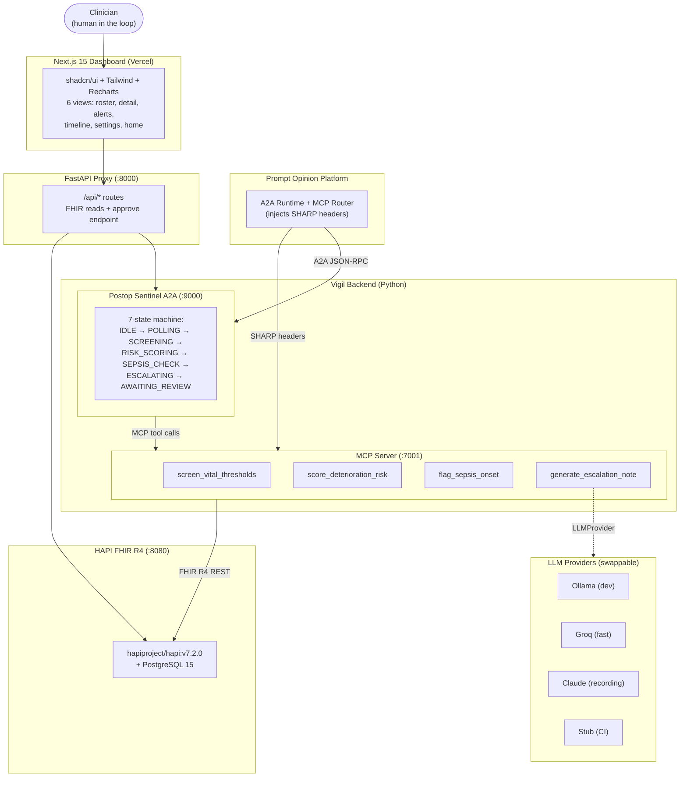

# Vigil

[](#tests)
[](#tech-stack)
[](#license)
[](#fhir-r4-resources)

**A postoperative + maternal deterioration sentinel built on MCP and A2A.**

> Submission for the **Agents Assemble — Healthcare AI Endgame** hackathon (Devpost, deadline 2026-05-11). Option B: published to the [Prompt Opinion Marketplace](https://www.promptopinion.ai/) as both an MCP Server (Path A) and an A2A Agent (Path B).

---

## The problem

Deaths within 30 days of surgery are the third greatest contributor to global deaths — **4.2 million a year**, after ischaemic heart disease and stroke ([Nepogodiev, *Lancet Global Health* 2019](https://www.thelancet.com/journals/lancet/article/PIIS0140-6736(18)33139-8/fulltext)). A woman dies every two minutes from obstetric complications ([WHO 2023](https://www.who.int/news/item/23-02-2023-a-woman-dies-every-two-minutes-due-to-pregnancy-or-childbirth--un-agencies)). In both cases the warning signs appear 30–60 minutes before crisis, but no single vital crosses a hard threshold — the danger lives in the pattern across BP trend, HR trend, and surgical context. On post-surgical wards one nurse commonly covers 6–8 patients ([Prin & Wunsch, AJRCCM 2014](https://pmc.ncbi.nlm.nih.gov/articles/PMC4315815/)). No human holds that multivariate pattern in their head for all of them.

Clinicians override 70–90% of threshold-based CDS alerts ([AHRQ PSNet](https://psnet.ahrq.gov/primer/alert-fatigue)). Vigil raises on *trend patterns*, not single thresholds, specifically to stay below the override ceiling.

## What it is

Two published, independent layers that interoperate:

- **Path A — MCP Server.** Four reusable clinical early-warning tools, exposed over Anthropic's Model Context Protocol. Any MCP-compatible agent on Prompt Opinion can call them. Each tool enforces a published clinical standard deterministically, then layers an LLM reasoning pass for patient-specific context.
- **Path B — A2A Agent.** A Postoperative Deterioration Sentinel. Runs a monitoring loop, calls the MCP tools in sequence, drafts SBAR escalation notes for clinician review, and never takes an autonomous action — every alert requires one-click approval.

Both layers are discoverable from the Prompt Opinion Marketplace. The same four tools work on post-op patients AND postpartum patients with zero code changes — the demo's climactic moment is at 2:00 when the sepsis tool fires on a postpartum patient using the exact same pipeline.

---

## Screenshots

> Screenshots are populated by the screenshot-curator. Place files in `docs/img/`.

| View | Screenshot |
|---|---|
| Patient roster |  |
| Patient detail + vitals chart |  |
| SBAR escalation note |  |
| Review queue + approve |  |
| A2A agent timeline |  |
| System status |  |

---

## Architecture



### Data flow — how an alert reaches a clinician

```
Agent tick fires (IDLE → POLLING)
  │
  ├─ screen_vital_thresholds ─── FHIR Observations → MEWT/qSOFA check
  │   └─ status = TRIGGERED? ─── yes → continue, no → IDLE
  │
  ├─ score_deterioration_risk ── trend analysis over ≥3 readings → risk band
  │
  ├─ flag_sepsis_onset ───────── CDC ASE criteria → sepsis suspected?
  │
  └─ generate_escalation_note ── LLM drafts SBAR (never writes to FHIR)
       │
       └─ Review Queue (SQLite) ── clinician sees alert in dashboard
            │
            └─ "Approve & send RRT" ── FastAPI proxy writes:
                 ├─ Communication (SBAR payload)
                 └─ AuditEvent (audit trail)
                      to HAPI FHIR → toast confirms
```

---

## Clinical standards used

Every rule cites a public standard. Nothing is invented.

| Standard | What we use it for | Source |
|---|---|---|
| MEWT (Modified Early Warning Trigger) | Vital-sign threshold screen | Shields 2016 *AJOG*; Subbe 2001 *QJM* |
| qSOFA (Sepsis-3) | Sepsis risk marker (RR ≥22, SBP ≤100, altered mentation) | Singer 2016 *JAMA* |
| CDC Adult Sepsis Event (ASE) | Sepsis recognition surveillance criteria | CDC 2018 toolkit |
| KDIGO 2012 | AKI staging by creatinine + urine output | KDIGO guideline 2012 |
| ACOG CO-794 (QBL) | Postpartum hemorrhage quantification | ACOG 2019 |
| SBAR | Escalation handoff format | IHI / Joint Commission |
| FHIR R4 + LOINC | Data access + clinical code consistency | HL7 FHIR R4 spec |

Full citations, DOIs, and strength ratings in [`docs/CLINICAL_EVIDENCE.md`](docs/CLINICAL_EVIDENCE.md).

---

## FHIR R4 resources

No custom extensions. Every resource is vanilla FHIR R4.

| Resource | Direction | Purpose |
|---|---|---|
| `Patient` | Read | Demographics, age, gender |
| `Observation` (vital-signs) | Read | HR, BP, RR, SpO2, Temp — by LOINC code |
| `Observation` (laboratory) | Read | Lactate, WBC, creatinine, bilirubin, platelets |
| `Condition` | Read | Active comorbidities for risk weighting |
| `Encounter` | Read | Admission context, surgical procedure |
| `Procedure` | Read | Surgical/OB procedure type |
| `Communication` | Write (on approve) | SBAR escalation payload, sender=agent, recipient=care-team |
| `AuditEvent` | Write (on approve) | Audit trail of clinician approval action |

### LOINC mapping

| Parameter | LOINC | UCUM unit |
|---|---|---|
| Systolic BP | `8480-6` | `mm[Hg]` |
| Diastolic BP | `8462-4` | `mm[Hg]` |
| Heart rate | `8867-4` | `/min` |
| Respiratory rate | `9279-1` | `/min` |
| SpO2 | `59408-5` | `%` |
| Body temperature | `8310-5` | `Cel` |
| Lactate | `2524-7` | `mmol/L` |
| WBC | `63120-2` | `10*3/uL` |
| Creatinine | `2160-0` | `mg/dL` |
| Bilirubin (total) | `1975-2` | `mg/dL` |
| Platelet count | `777-3` | `10*3/uL` |

---

## SHARP header compliance

Vigil implements the [SHARP on MCP](https://www.sharponmcp.com/) standard for passing FHIR context between the Prompt Opinion runtime and clinical tools. Three HTTP headers carry the context:

| Header | Purpose | Required? |
|---|---|---|
| `x-fhir-server-url` | Base URL of the FHIR R4 server | Yes — rejected with 400 if missing |
| `x-fhir-access-token` | Bearer token for FHIR auth | No — empty tolerated (dev HAPI has no auth) |
| `x-patient-id` | FHIR Patient resource id | No — can come from tool input instead |

**How headers flow through the stack:**

1. **MCP path (Path A):** Prompt Opinion injects the 3 headers on every HTTP request to the MCP server. The server advertises `ai.promptopinion/fhir-context` in its capability extensions. Tools read headers via `ctx.request_context.request.headers`.

2. **A2A path (Path B):** FHIR context travels inside the JSON-RPC body as `message.metadata["…/fhir-context"]`. The agent's `extract_fhir_from_metadata()` extracts it, then `fhir_metadata_to_sharp_headers()` bridges it back to the 3 SHARP headers for downstream MCP tool calls.

3. **Frontend proxy:** The Next.js app never touches SHARP headers directly. The FastAPI proxy at `:8000` uses server-side `FHIR_BASE_URL` for all HAPI reads. No bearer tokens reach the browser.

**Security:** Bearer tokens are redacted in all log paths (`_redact_token()` shows first 4 chars + `****`). SSRF protection validates `x-fhir-server-url` against a configurable allowlist (SEC-01). 39 compliance tests in `tests/test_sharp_compliance.py`.

---

## Reusability: same tools, different ward

The same 4 MCP tools work on postop AND postpartum patients. The only difference is the synthetic data trajectory — no code branches, no conditional logic, no ward-specific tools.

```
PT-007 (postop CABG, day 2)          PT-009 (postpartum, day 3)
─────────────────────────            ─────────────────────────
screen_vital_thresholds  → TRIGGERED screen_vital_thresholds  → TRIGGERED
score_deterioration_risk → HIGH      score_deterioration_risk → HIGH
flag_sepsis_onset        → POSSIBLE  flag_sepsis_onset        → CONFIRMED
generate_escalation_note → SBAR      generate_escalation_note → SBAR
                                     (same tools, zero code changes)
```

This is the substitutability thesis applied to MCP tools: one build, many wards, many hospitals.

---

## Security posture

Full review in [`docs/SECURITY_REVIEW.md`](docs/SECURITY_REVIEW.md) (17 findings, 20-item checklist).

| Control | Status |
|---|---|
| SSRF protection on `x-fhir-server-url` | Allowlist enforced (SEC-01) |
| JWT signature verification | Skipped (upstream pattern); documented as known limitation (SEC-02) |
| Bearer token redaction in logs + LLM prompts | `_redact_token()` strips before serialization (SEC-03) |
| API key auth on MCP/A2A/proxy | `X-API-Key` middleware on all services (SEC-05) |
| No real PHI | All data synthetic, all ranges public domain |
| No autonomous FHIR writes | Agent drafts only; clinician must click Approve |
| Dependency pinning | `uv.lock` pinned, no floating versions |

---

## Quickstart

### Prerequisites

- Docker + Docker Compose (for HAPI FHIR)
- Python 3.11+ with [uv](https://docs.astral.sh/uv/)
- Node.js 20+ with pnpm
- (Optional) Ollama with `qwen2.5:7b-instruct` for local LLM dev

### One-command demo

```bash
make demo          # starts HAPI + seeds data + MCP + A2A agent + proxy + frontend
```

Open [http://localhost:3000](http://localhost:3000) in your browser.

### Step-by-step

```bash
# 1. Infrastructure — bring up HAPI FHIR + PostgreSQL
make up

# 2. Seed synthetic patients (10 patients × 6 timepoints × 4 trajectories)
make seed

# 3. Start MCP server (streamable HTTP on :7001)
make mcp

# 4. Start A2A agent (on :9000)
make agent

# 5. Start FastAPI proxy (on :8000)
make proxy

# 6. Start Next.js dashboard (on :3000)
make frontend
```

### Environment variables

```bash
LLM_PROVIDER=ollama    # ollama | groq | claude | stub
OLLAMA_MODEL=qwen2.5:7b-instruct
GROQ_API_KEY=...       # only if LLM_PROVIDER=groq
ANTHROPIC_API_KEY=...  # only if LLM_PROVIDER=claude
FHIR_BASE_URL=http://localhost:8080/fhir
```

Set `LLM_PROVIDER=claude` before recording the demo video. Development default is `ollama`.

### Useful make targets

| Target | What it does |
|---|---|
| `make demo` | Full orchestrated startup with health checks |
| `make demo-stop` | Tear down all services |
| `make demo-warmup` | Pre-flight: reseed HAPI, ping LLM, tick agent, warm routes |
| `make test` | Run pytest (312 tests) |
| `make lint` | Ruff + mypy |
| `make e2e` | Playwright smoke tests (requires demo running) |

---

## Repository layout

```
backend/
  mcp_server/        # FastMCP tools + streamable HTTP app
    tools/            # 4 clinical tools
  a2a_agent/          # Postop Sentinel state machine + SBAR drafter
  api/                # FastAPI proxy (FHIR reads + approve endpoint)
  criteria/           # MEWT / qSOFA / CDC ASE / KDIGO rule modules
  fhir/               # HAPI FHIR client + synthetic bundle loader
  llm/                # Provider abstraction (ollama/groq/claude/stub)
  schemas.py          # Pydantic v2 models for all tool I/O
frontend/             # Next.js 15 app (shadcn/ui + Tailwind + Recharts)
  app/                # 6 routes: home, patients, [id], alerts, timeline, settings
  components/         # vitals-chart, patients-table, risk-badge, alert-timeline
data/                 # Synthetic FHIR bundles (10 patients × 4 trajectories)
docs/                 # Planning set + submission copy
  img/                # Screenshots (populated by screenshot-curator)
scripts/              # demo.sh, seed_patients.sh, tunnel scripts
tests/                # 13 test files, 312 tests, ~4.4K LOC
  integration/        # Full MCP tool chain tests
  e2e/                # Playwright smoke tests
```

---

## Tech stack

| Component | Choice |
|---|---|
| MCP server | Python 3.11+, official `mcp` SDK (FastMCP), streamable HTTP |
| A2A agent | `a2a-sdk` (raw, no google-adk dependency) |
| FHIR store | HAPI FHIR R4 `v7.2.0` in Docker + PostgreSQL 15 |
| FHIR client | `httpx` async + thin wrapper |
| Schemas | `pydantic` v2 (strict JSON schema validation) |
| Frontend | Next.js 15 (App Router) + shadcn/ui + Tailwind + Recharts |
| LLM (dev) | Ollama (Qwen 2.5 7B-Instruct) |
| LLM (demo) | Anthropic Claude Sonnet 4.6 |
| LLM (fast) | Groq (Llama 3.3 70B) |
| Deploy (frontend) | Vercel |
| Deploy (backend) | Docker Compose (local) / Cloud Run (production) |

---

## The 3-minute demo

| Time | Beat |
|---|---|
| 0:00–0:20 | 4.2M contributor stat + patient roster table |
| 0:20–0:50 | PT-001 stable → NORMAL → "no false alarms" |
| 0:50–1:20 | PT-007 deteriorating → TRIGGERED + HIGH risk → agent timeline shows 4 tool calls |
| 1:20–1:50 | SBAR drafted live → clinician approves → Communication + AuditEvent written |
| 1:50–2:20 | PT-009 postpartum → same tools fire EMERGENCY → zero code changes |
| 2:20–2:45 | Marketplace listing — both paths published |
| 2:45–3:00 | "4.2M + 260K. One platform. Vigil." |

Detailed script, shot list, and risk moments: [`docs/DEMO_SCRIPT.md`](docs/DEMO_SCRIPT.md).

---

## Evaluation & limitations

| Field | Value |
|---|---|
| **Intended use** | Clinical decision *support* for postop/postpartum deterioration detection |
| **Target population** | Post-surgical inpatients; postpartum patients (cameo) |
| **Data source** | Synthetic FHIR bundles (10 patients × 4 trajectories) |
| **Clinical criteria** | MEWT, qSOFA (Sepsis-3), CDC ASE, KDIGO 2012, ACOG QBL |
| **Known biases** | Single synthetic cohort; no real-world demographic diversity testing |
| **Failure modes** | LLM hallucination in SBAR prose; trend thresholds not externally validated |
| **Validation status** | Demo-ground-truth only. Local validation required before any clinical deployment |

Vigil's hemodynamic trend rule (SBP drop ≥10% AND HR rise ≥15% over 2h) is an operational threshold, not a published value. Prospective validation required before clinical use.

---

## Ground rules

- **Zero real PHI.** All data is synthetic, all ranges are public domain.
- **No autonomous action.** The agent never sends an RRT alert without clinician approval.
- **Deterministic clinical rules.** LLM reasoning is only layered on top of rule-engine output — never to decide whether to escalate.
- **FHIR R4 correctness.** Every number maps to a real `Observation` with a real LOINC code.

---

## Contributing

```bash
# Install dependencies
uv sync
cd frontend && pnpm install

# Run tests before submitting
make test        # 312 pytest tests
make lint        # ruff + mypy
make e2e         # playwright (requires make demo running)

# Commit format
git commit -m "feat(B3): add qSOFA trend scoring"
#                ^scope    ^description
# Scopes: B1-B8 (backend), FE1-FE6 (frontend), I1-I3 (integration), P1-P4 (docs)
```

---

## Document index

| # | Doc | Purpose |
|---|---|---|
| 1 | [`PROJECT_BRIEF.md`](docs/PROJECT_BRIEF.md) | North star — if it conflicts with anything else, it wins |
| 2 | [`ARCHITECTURE.md`](docs/ARCHITECTURE.md) | System design, sequence diagrams, tech stack rationale |
| 3 | [`API_CONTRACTS.md`](docs/API_CONTRACTS.md) | MCP tool I/O schemas, A2A AgentCard, SHARP headers |
| 4 | [`SYNTHETIC_DATA_SPEC.md`](docs/SYNTHETIC_DATA_SPEC.md) | Exact vitals per patient × timepoint × trajectory |
| 5 | [`FRONTEND_SPEC.md`](docs/FRONTEND_SPEC.md) | Pages, components, design tokens |
| 6 | [`DEMO_SCRIPT.md`](docs/DEMO_SCRIPT.md) | 3-minute beat-by-beat video script + judge hooks |
| 7 | [`JUDGE_HOOKS.md`](docs/JUDGE_HOOKS.md) | Target judge profiles and hook mapping |
| 8 | [`CLINICAL_EVIDENCE.md`](docs/CLINICAL_EVIDENCE.md) | Citations bibliography — every claim cites here |
| 9 | [`SECURITY_REVIEW.md`](docs/SECURITY_REVIEW.md) | 17 findings, 20-item build checklist |
| 10 | [`PROMPT_OPINION_INTEGRATION.md`](docs/PROMPT_OPINION_INTEGRATION.md) | SHARP patterns, marketplace publishing |

---

## Credits

Built for the **Agents Assemble — Healthcare AI Endgame** hackathon by Raymond + Claude Code teammates.

**Clinical standards:** MEWT (Shields 2016), qSOFA/Sepsis-3 (Singer 2016), CDC Adult Sepsis Event (2018), KDIGO (2012), SBAR (IHI/Joint Commission), FHIR R4 (HL7).

**Key dependencies:** [MCP Python SDK](https://github.com/modelcontextprotocol/python-sdk) · [a2a-sdk](https://github.com/a2aproject/a2a-python) · [HAPI FHIR](https://hapifhir.io/) · [Next.js](https://nextjs.org/) · [shadcn/ui](https://ui.shadcn.com/) · [Recharts](https://recharts.org/) · [Prompt Opinion](https://www.promptopinion.ai/)

**Platform:** [Prompt Opinion Marketplace](https://www.promptopinion.ai/) — SHARP on MCP reference repos at [po-community-mcp](https://github.com/prompt-opinion/po-community-mcp) and [po-adk-python](https://github.com/prompt-opinion/po-adk-python).

## License

MIT. All clinical data is synthetic and public-domain in origin.
