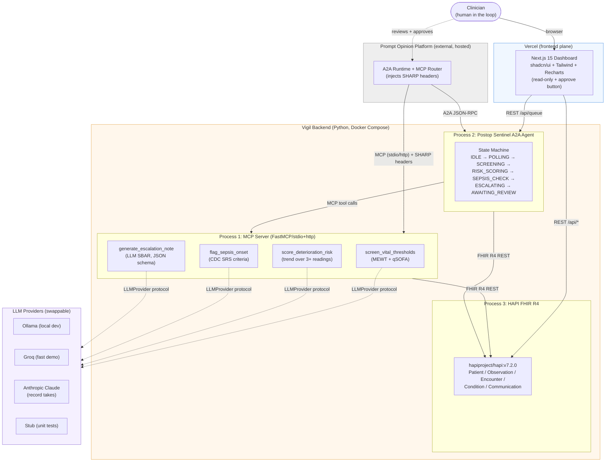
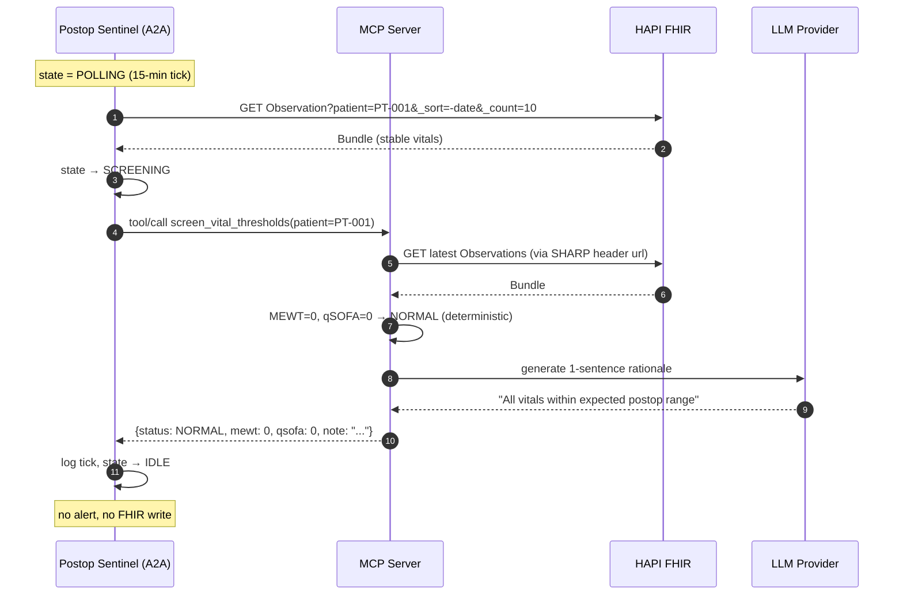
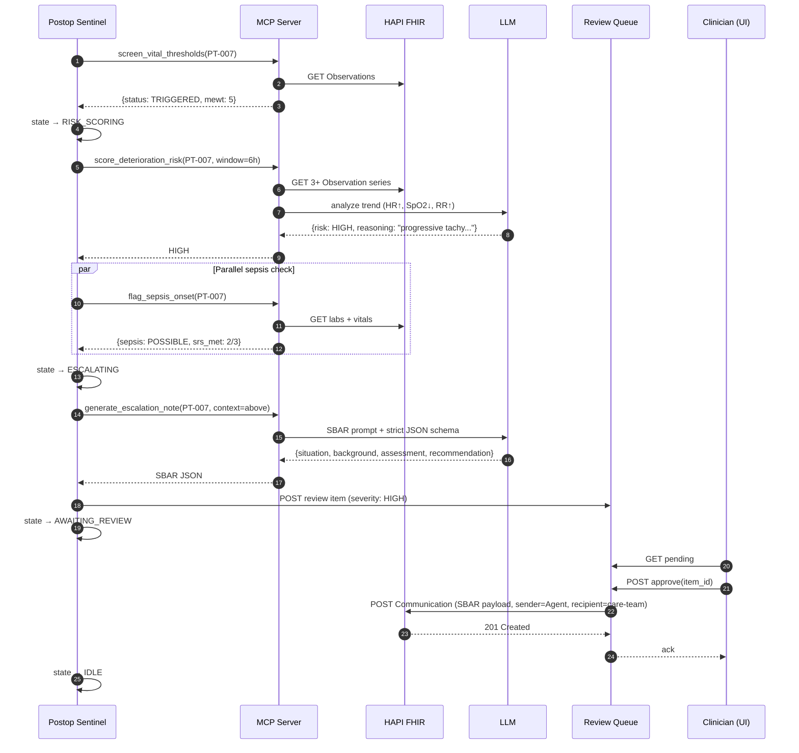
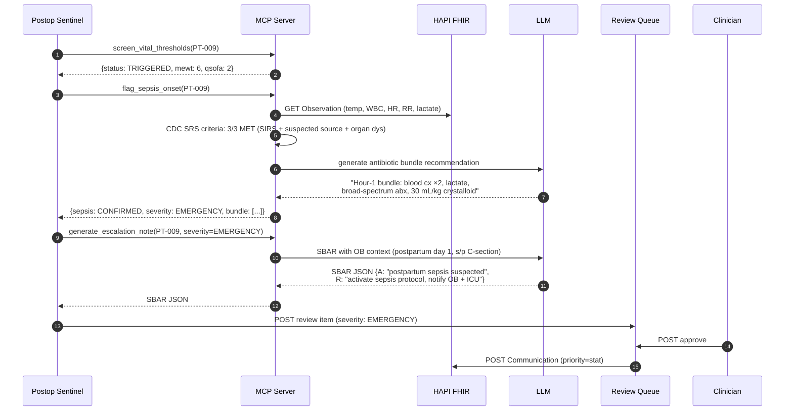

# Vigil — Architecture

> **Project**: Vigil — Postop Sentinel
> **Hackathon**: Agents Assemble — Healthcare AI Endgame (submission deadline 2026-05-11)
> **Platform**: [Prompt Opinion](https://promptopinion.ai)
> **Status**: Planning doc (pre-build). Source of truth for implementation.
> **Last updated**: 2026-04-15

---

## 1. System Overview

Vigil is a **three-layer clinical early-warning system** that monitors the same post-surgical deterioration signals on both postoperative and postpartum patients, demonstrating that a single set of FHIR-driven MCP tools generalizes across care settings. **Layer 1** is a Python MCP server exposing four deterministic-plus-LLM tools against a HAPI FHIR R4 store. **Layer 2** is the `Postop Sentinel` A2A agent (Google [`a2a-sdk`](https://pypi.org/project/a2a-sdk/)) which runs a 7-state polling loop, invokes the MCP tools via Prompt Opinion's runtime, and drops approved escalations into a human-review queue. **Layer 3** is a Next.js 15 / shadcn dashboard on Vercel that visualizes vital trends, surfaces the review queue, and posts clinician approvals back into FHIR as `Communication` resources. All three layers are orchestrated through the Prompt Opinion platform, which injects FHIR session context via three SHARP HTTP headers (`x-fhir-server-url`, `x-fhir-access-token`, `x-patient-id`) into every MCP call. Source: [`po-community-mcp/python/mcp_constants.py`](https://github.com/prompt-opinion/po-community-mcp/blob/main/python/mcp_constants.py).

---

## 2. Component Diagram



Protocol legend: **MCP** (JSON-RPC over stdio or streamable HTTP per [MCP spec](https://modelcontextprotocol.io)), **A2A** (JSON-RPC over HTTP per [Agent2Agent protocol](https://a2a-protocol.org)), **FHIR** (REST/JSON per [HL7 FHIR R4](https://hl7.org/fhir/R4/)), **REST** (Next.js API routes).

---

## 3. Sequence Diagrams

### 3.1 Scenario A — Normal tick (PT-001, stable postop)



### 3.2 Scenario B — HIGH deterioration (PT-007, postop day 2)



### 3.3 Scenario C — EMERGENCY sepsis on postpartum (PT-009)

> **Architectural point**: PT-009 is a postpartum patient. The same four tools fire. No code branches on "postpartum vs postop" — maternal is just a synthetic trajectory.



---

## 4. Data Flow Narrative

### Scenario A (Normal)
1. Agent tick fires. A2A state: `IDLE → POLLING`.
2. Agent fetches latest `Observation` bundle for PT-001 directly from HAPI (bypassing MCP for the poll — MCP tools are for _analysis_, not _polling_).
3. Agent invokes `screen_vital_thresholds`. MCP reads SHARP headers (`x-patient-id=PT-001`, `x-fhir-server-url=http://hapi:8080/fhir`), constructs an internal `FhirContext`, fetches the same data, runs the MEWT/qSOFA rule check (pure Python, deterministic), calls LLM only for a one-line rationale.
4. Result: `{status: "NORMAL"}`. Agent logs and returns to `IDLE`. **No FHIR write.**

### Scenario B (HIGH deterioration)
1. `screen_vital_thresholds` → `TRIGGERED` (MEWT=5).
2. Agent transitions `RISK_SCORING`. Calls `score_deterioration_risk` which reads the 6h window (≥3 readings) and asks the LLM to characterize the trajectory. Output: `{risk: "HIGH", reasoning: str, llm_confidence: float}`.
3. In parallel, `flag_sepsis_onset` runs CDC Surveillance criteria; returns `POSSIBLE` (2/3 met).
4. `generate_escalation_note` receives the combined context (screen + risk + sepsis) and emits strict-schema SBAR JSON, validated with `pydantic`.
5. Agent POSTs the SBAR to its local review queue (SQLite or in-memory). **Nothing is written to FHIR yet.**
6. Clinician opens the Next.js dashboard, reviews the SBAR + trend chart, clicks Approve.
7. On approval, the queue service writes a FHIR `Communication` resource: `sender=Device/vigil-agent`, `recipient=PractitionerRole/care-team`, `payload.contentString=<SBAR>`, `status=completed`, `category=alert`.

### Scenario C (EMERGENCY sepsis, postpartum)
Identical control flow to B, with two differences:
- `flag_sepsis_onset` returns `CONFIRMED` severity `EMERGENCY` because CDC SRS is fully met.
- The escalation note LLM prompt receives a `patient_context` blob including the postpartum `Encounter` + `Procedure` (C-section). No tool knows or cares that this patient is postpartum; the data comes from FHIR and flows through generically. **This is the unification proof.**

---

## 5. Tech Stack

| Component | Language / Framework | Why | Alternative Considered | Why Rejected |
|---|---|---|---|---|
| MCP Server | Python 3.11+, [`mcp[cli]`](https://github.com/modelcontextprotocol/python-sdk) (FastMCP bundled) | Official SDK, matches `po-community-mcp` pattern, stdio+HTTP transport built-in | TypeScript MCP SDK | Team is Python-first; FHIR client ecosystem better in Python |
| A2A Agent | Python, [`a2a-sdk`](https://pypi.org/project/a2a-sdk/) (Google / a2aproject) | Canonical Agent2Agent impl, AgentCard + AgentExecutor abstractions | Hand-roll JSON-RPC | Prompt Opinion runtime expects spec-compliant agents |
| FHIR store | [`hapiproject/hapi:v7.2.0`](https://hub.docker.com/r/hapiproject/hapi) | Zero-config R4 server, Docker-ready, accepts `$upload` bundles | Medplum, Firely | HAPI is the dev-community default; no auth to wrestle with |
| FHIR client | `httpx` + thin wrapper (mirroring `po-community-mcp/python/fhir_client.py`) | Async, header pass-through trivial | `fhir.resources` + `fhirclient` | Too heavy; we only need 5 resource types |
| Schemas | `pydantic` v2 | MCP tool input/output validation, SBAR strict schema | `dataclasses` + jsonschema | Pydantic is idiomatic in FastMCP |
| Frontend | Next.js 15 (App Router), shadcn/ui, Tailwind v4, Recharts | Vercel-native, shadcn components match Prompt Opinion aesthetic | SvelteKit | Judge familiarity + ecosystem |
| Hosting (frontend) | Vercel | Zero-config Next.js, free tier sufficient | Cloudflare Pages | Next.js edge runtime quirks |
| Hosting (backend, local) | Docker Compose | Reproducible for judges, pins HAPI version | Bare `uvicorn` | Need HAPI anyway — compose is a freebie |
| LLM (dev) | Ollama (llama3.1:8b) | Free, offline, fast enough for rules+rationale | OpenAI | Cost + no key required |
| LLM (demo record) | Anthropic Claude (Sonnet 4.5) | Best SBAR quality for the tape | Groq Llama | Narrative quality matters for judges |
| LLM (fast fallback) | Groq (llama-3.3-70b) | Low latency if Ollama too slow on laptop | — | — |

---

## 6. Deployment Topology

### Local Dev (daily)
```
docker compose up:
  ├── hapi (hapiproject/hapi:v7.2.0, :8080)
  ├── mcp-server (python, :7001 streamable-http)
  └── a2a-agent (python, :9000, polling loop on)

next dev (host machine, :3000)
ollama serve (host, :11434)
```
Developer runs `scripts/seed_fhir.py` once to load PT-001/007/009 synthetic bundles.

### Demo Recording (pre-submission, ~May 8)
Same stack, but `LLM_PROVIDER=anthropic` and agent poll interval shortened to 60s for on-camera flow. Frontend deployed to a throwaway Vercel preview pointing at an ngrok tunnel into the local agent.

### Hackathon Submission (May 11)
- **MCP server + A2A agent**: registered with Prompt Opinion cloud. Prompt Opinion's A2A runtime discovers our `AgentCard` (served at `/.well-known/agent-card.json` per A2A spec) and our MCP server's tool manifest. Judges trigger via Prompt Opinion's UI.
- **HAPI FHIR**: remains on a small always-on VPS (Fly.io or Railway) so Prompt Opinion can reach it. SHARP headers point there.
- **Frontend**: Vercel production URL. Linked from submission.

---

## 7. LLM Provider Abstraction

**Why**: Dev on Ollama (free, offline), record on Claude (best output), fall back to Groq (fast if laptop melts), stub in unit tests (deterministic). Switching must be one env var.

**Pattern**:
```python
# llm/provider.py
class LLMProvider(Protocol):
    async def complete(self, system: str, user: str, *, json_schema: dict | None = None) -> str: ...

class OpenAICompatProvider:
    """Shared impl for Ollama + Groq — both expose /v1/chat/completions."""
    def __init__(self, base_url: str, model: str, api_key: str = "ollama"): ...

class AnthropicProvider:
    """Dedicated — uses messages API + prompt caching for the fixed system prompt."""

def get_provider() -> LLMProvider:
    match os.environ["LLM_PROVIDER"]:
        case "ollama": return OpenAICompatProvider("http://localhost:11434/v1", "llama3.1:8b")
        case "groq":   return OpenAICompatProvider("https://api.groq.com/openai/v1", "llama-3.3-70b-versatile", os.environ["GROQ_API_KEY"])
        case "anthropic": return AnthropicProvider("claude-sonnet-4-5")
        case "stub":   return StubProvider()
```

**Cost implication**: rough estimate — a full demo run (4 tools × 3 scenarios × ~2k tokens) costs **<$0.05** on Claude Sonnet and **$0** on Ollama. Development is effectively free; recording is one rounding error.

Prompt caching is worth it on `AnthropicProvider` because the SBAR system prompt (~1.5k tokens of clinical format rules) is identical across every call.

---

## 8. Security & Non-Goals

- **Synthetic FHIR only.** PT-001/007/009 are fabricated. No real PHI ever touches any layer. Every commit that adds patient data is reviewed against a `SYNTHETIC_ONLY` checklist.
- **No custom auth.** Prompt Opinion handles clinician identity and session. Our MCP server trusts the SHARP headers it receives. HAPI runs with auth disabled locally.
- **No autonomous action.** Neither the MCP tools nor the A2A agent ever write to FHIR. `generate_escalation_note` returns a `communication_draft` (unpersisted FHIR `Communication` shape); the A2A sentinel drops this draft into its local review queue at `AWAITING_REVIEW`; the **FastAPI proxy's `/approve` endpoint is the single FHIR write entry point for the entire stack**, and fires only when a human clicks Approve in the frontend. The state machine's `AWAITING_REVIEW` is a terminal leaf precisely because nothing downstream of it is allowed to touch HAPI without human confirmation.
- **Read-only frontend.** The dashboard is visualization + approve/reject buttons. No FHIR editing UI. No patient-data entry.
- **No PII in logs.** Structured logs include `patient_id` but never names/DOB; the synthetic seed has no names to begin with.
- **Out of scope**: RBAC, multi-tenant, audit trail beyond FHIR `Communication`, real-time WebSocket push (we poll), mobile UI.

---

## 9. Open Architectural Questions

1. **A2A server publishing model.** Should `Postop Sentinel` be a standalone [`a2a-sdk`](https://github.com/a2aproject/a2a-python) HTTP server with its own `AgentCard` at `/.well-known/agent-card.json`, **or** consumed only as an in-process module by Prompt Opinion's runtime? Looking at [`po-adk-python`](https://github.com/prompt-opinion/po-adk-python), the ADK exposes agents both ways — we should confirm which mode the hackathon judging harness uses. **Default assumption**: standalone HTTP server, because it's demoable independently and matches A2A spec literally.
2. **MCP transport: stdio vs streamable-http.** Prompt Opinion's cloud router almost certainly wants HTTP (stdio doesn't traverse the network). But for local dev + `mcp dev` inspector, stdio is easier. Do we run both transports from one `FastMCP` instance (supported) or ship two entry points? **Lean**: one instance, HTTP in Docker, stdio for `mcp dev`.
3. **Review queue persistence.** SQLite (simple, reproducible, but stateful between container restarts) vs in-memory (ephemeral, clean demos, but loses items on reload). For a 5-minute demo, in-memory is fine; for a judge poking at it over an hour, SQLite wins. **Need to decide before we build the queue service.**
4. **Who owns the 15-min polling cadence at demo time?** Real-world cadence is 15 min, but on-camera nobody waits 15 minutes. Do we (a) ship a `POLL_INTERVAL_SEC` env var and set it to 30 for demos, (b) add a manual "tick now" button to the dashboard, or (c) both? Option (b) is more honest about the simulation — recommend both.
5. **Does `generate_escalation_note` get the raw Observation bundle or a pre-digested summary?** Trade-off: raw bundle = more LLM tokens but better traceability; summary = cheaper + deterministic structure but we're trusting our own compression. **Lean**: pre-digested dict built by the agent, with raw bundle available as an optional `evidence` field for traceability.

---

## Appendix — Reference file layout (target, mirroring po-community-mcp)

```
vigil/
├── docker-compose.yml
├── mcp_server/
│   ├── main.py                  # FastMCP app + tool registration
│   ├── mcp_constants.py         # SHARP header names (copied from po-community-mcp)
│   ├── fhir_context.py          # request-scoped FHIR session
│   ├── fhir_client.py           # httpx wrapper
│   ├── tools/
│   │   ├── screen_vital_thresholds.py
│   │   ├── score_deterioration_risk.py
│   │   ├── flag_sepsis_onset.py
│   │   └── generate_escalation_note.py
│   └── llm/
│       ├── provider.py
│       ├── openai_compat.py
│       └── anthropic_provider.py
├── a2a_agent/
│   ├── main.py                  # a2a-sdk AgentExecutor + HTTP server
│   ├── agent_card.json
│   ├── state_machine.py
│   └── review_queue.py
├── frontend/                    # Next.js 15
├── fixtures/
│   └── synthetic/               # PT-001, PT-007, PT-009 bundles
└── docs/
    ├── PROJECT_BRIEF.md
    └── ARCHITECTURE.md (this file)
```

---

**References**
- MCP Python SDK: https://github.com/modelcontextprotocol/python-sdk
- A2A Python SDK: https://pypi.org/project/a2a-sdk/ · https://github.com/a2aproject/a2a-python
- A2A Protocol: https://a2a-protocol.org
- Prompt Opinion community MCP (patterns we copy): https://github.com/prompt-opinion/po-community-mcp
- Prompt Opinion ADK (Python): https://github.com/prompt-opinion/po-adk-python
- HAPI FHIR Docker: https://hub.docker.com/r/hapiproject/hapi
- HL7 FHIR R4: https://hl7.org/fhir/R4/
- CDC Adult Sepsis Event Surveillance: https://www.cdc.gov/sepsis/php/hospital/index.html
