# Vigil — BUILD_PLAN.md

Postop Sentinel on FHIR. Single MCP server (4 tools) + 1 A2A agent + Next.js frontend + HAPI FHIR backed by synthetic data. Built by a Claude Code agent team (up to 10 parallel teammates) coordinated by an integration-lead.

---

## 1. Critical Path

The longest unparallelizable chain runs Foundation -> Backend -> Integration -> Demo. Everything else fans out around it.

```mermaid
gantt
    title Vigil Critical Path (hours)
    dateFormat  X
    axisFormat  %Hh
    section Foundation
    F1 Repo scaffold              :f1, 0, 2
    F2 Criteria rule modules      :f2, after f1, 4
    F4 FHIR client lib            :f4, after f1, 3
    F5 LLM provider abstraction   :f5, after f1, 3
    F9 PO dry-run                 :f9, after f1, 3
    section Backend
    B1 MCP server skeleton        :b1, after f2 f4 f5, 2
    B2 screen_vital_thresholds    :b2, after b1, 3
    B7 A2A Postop Sentinel agent  :b7, after b2, 5
    section Integration
    I1 End-to-end wiring          :i1, after b7, 3
    I5 Public hosting             :i5, after i1, 3
    I3 Frontend <-> backend glue  :i3, after i1, 3
    section Polish
    P1.5 Pre-flight + rehearsal   :p15, after i3, 2
    P1 Demo script + record       :p1, after p15, 4
    P3 Submit Devpost + Marketplace :p3, after p1, 2
```



Critical path length: **F1(2) + F2(4) + B1(2) + B2(3) + B7(5) + I1(3) + I3(3) + P1.5(2) + P1(4) + P3(2) = 30h** of single-thread work. Everything else runs in parallel and does not extend this chain.

---

## 2. Phase Table

| Phase | Entry Conditions | Tasks | Exit Criteria | Milestone |
|---|---|---|---|---|
| **1. Foundation** | BRIEF + ARCHITECTURE approved, repo initialized | F1–F8 | Repo scaffolded; criteria modules pass unit tests; synthetic patients loaded into HAPI; FHIR client + LLM provider importable; Next.js shell renders | "Hello Vigil" — `pytest` green, `npm run dev` shows shell, HAPI `GET /Patient` returns 10 |
| **2. Backend** | All Phase 1 tasks green; HAPI reachable at localhost:8080 | B1–B9 | MCP server exposes 4 tools via `mcp dev`; each tool passes integration test on PT-001 and PT-007; A2A agent runs state machine PT-001/007/009/010 | "Tools work" — `uv run mcp dev` inspector shows 4 tools returning valid payloads |
| **3. Frontend + Integration** | Phase 2 green; API_CONTRACTS frozen | FE1–FE7, I1–I4 | All 4 dashboard views render live data; SHARP headers round-trip; A2A agent renders in Timeline view | "Demo-ready" — full flow: click patient -> tool call -> LLM annotation -> chart update |
| **4. Polish + Submit** | Phase 3 green; end-to-end demo works on clean clone | P1–P6 | Video under 3:00 recorded; README written; Devpost draft filled; Marketplace Path A + B published | "Submitted" — Devpost shows submission, Marketplace shows both listings |

---

## 3. Task List

### Phase 1 — Foundation

**F1 — Repo scaffold & tooling**
- Owner: integration-lead / backend-architect · Depends: none · Est: 2h
- Description: Create monorepo layout (`backend/`, `frontend/`, `data/`, `docs/`, `tests/`), pyproject.toml with `mcp`, `a2a-sdk`, `httpx`, `pydantic`, pre-commit, ruff, pytest. GitHub Actions CI stub.
- Acceptance: `uv sync` installs clean / `pytest` runs (0 tests ok) / `ruff check` passes / CI passes on empty push / README stub present / **LICENSE file (MIT) present in repo root** / `.gitignore` covers `.env`, `__pycache__`, `node_modules`, `.next`
- Artifacts: `pyproject.toml`, `.github/workflows/ci.yml`, folder tree, `LICENSE`, `.gitignore`

**F2 — Criteria rule modules**
- Owner: backend-architect · Depends: F1 · Est: 4h
- Description: Pure-Python `criteria/mewt.py`, `criteria/qsofa.py`, `criteria/sirs.py`, `criteria/news2.py`. Each takes an Observations dict and returns `{score, triggered, rationale}`. No I/O.
- Acceptance: >=90% branch coverage / table-driven tests on canonical vital sets / zero deps beyond stdlib+pydantic / docstrings cite thresholds / returns deterministic output
- Artifacts: `backend/criteria/*.py`, `tests/test_criteria.py`

**F3 — Synthetic FHIR bundles (10 patients)**
- Owner: data-engineer · Depends: F1 · Est: 6h
- Description: Generate exactly 10 trajectories (PT-001..PT-010) per `SYNTHETIC_DATA_SPEC.md` as FHIR R4 Bundles. Each patient must include: `Patient`, `Encounter`, `Procedure`, vital `Observation` time series at 6 timepoints (per §2.1–2.4), **lab `Observation` entries per §2.5** (lactate 2524-7, WBC 6690-2, creatinine 2160-0, bilirubin 1975-2, platelets 777-3), **1–3 `Condition` resources per patient** (comorbidity profile per §5 table), and **`MedicationAdministration` entries per §5** (antibiotic start times; for PT-009 the start time must be AFTER the sepsis-onset timepoint so `flag_sepsis_onset` correctly flags the pre-administration window).
- Acceptance: Bundles validate against HL7 FHIR R4 schema / PT-007@T+2h satisfies the hemodynamic trend rule (CLINICAL_EVIDENCE §2.3) / PT-009@T+4h labs satisfy `lactate ≥ 4` AND `WBC ≥ 18` / PT-001 stays normal / `Condition` + `MedicationAdministration` present for every patient / all LOINC + SNOMED codes standard / `seed.sh` reloads HAPI clean
- Artifacts: `data/patients/PT-00{1..10}.json`, `data/seed.sh`

**F4 — FHIR client library**
- Owner: backend-architect · Depends: F1 · Est: 3h
- Description: Thin `httpx`-based async client wrapping HAPI endpoints: `get_patient`, `get_observations(patient_id, since)`, `get_encounter`. Reads base URL from `x-fhir-server-url` SHARP header.
- Acceptance: Unit test with mocked httpx passes / integration test against live HAPI passes / typed pydantic FHIR models / retries on 5xx with backoff / 100% type-checked
- Artifacts: `backend/fhir/client.py`, `backend/fhir/models.py`

**F5 — LLM provider abstraction**
- Owner: backend-architect · Depends: F1 · Est: 3h
- Description: `llm/provider.py` with `Provider` ABC and `OllamaProvider`, `GroqProvider`, `ClaudeProvider` implementations. Provider selection is driven by the server-side `LLM_PROVIDER` env var (`ollama` | `groq` | `claude` | `stub`) per `PROJECT_BRIEF.md:56`; API keys come from server-side env vars (`GROQ_API_KEY`, `ANTHROPIC_API_KEY`), never from HTTP headers. SHARP headers (`x-fhir-server-url`, `x-fhir-access-token`, `x-patient-id`) are for FHIR context only.
- Acceptance: All 3 providers implement `async complete(prompt, max_tokens) -> str` / factory switches by `LLM_PROVIDER` env var / fallback to Ollama if key missing / unit test with mocked httpx / error path raises typed exception
- Artifacts: `backend/llm/provider.py`, `tests/test_llm_provider.py`

**F6 — HAPI FHIR docker compose**
- Owner: data-engineer · Depends: F1 · Est: 2h
- Description: `docker-compose.yml` with HAPI FHIR JPA server on port 8080 + postgres volume. `make up` / `make seed` targets.
- Acceptance: `docker compose up` healthy in <60s / `curl /fhir/metadata` returns 200 / seed script loads all 10 bundles / idempotent reload / documented in README
- Artifacts: `docker-compose.yml`, `Makefile`

**F7 — Next.js 15 + shadcn scaffold**
- Owner: frontend-developer · Depends: F1 · Est: 3h
- Description: Next.js 15 app router, Tailwind, shadcn/ui init, Recharts, layout shell with sidebar + 4 placeholder routes (Patients, Vitals, Timeline, Alerts).
- Acceptance: `npm run dev` serves at :3000 / shadcn components installed / 4 routes navigable / dark mode works / typed env client
- Artifacts: `frontend/app/**`, `frontend/components/ui/**`

**F8 — API_CONTRACTS.md freeze**
- Owner: backend-architect · Depends: F2, F4 · Est: 2h
- Description: Document JSON schemas for all 4 MCP tool inputs/outputs and A2A agent messages. Pydantic models exported for reuse.
- Acceptance: Every schema has example payload / schemas match pydantic models / reviewed by frontend-developer / locked with version string / linked from README
- Artifacts: `docs/API_CONTRACTS.md`, `backend/schemas.py`

**F9 — Prompt Opinion account + listing dry-run**
- Owner: integration-lead · Depends: F1 · Est: 3h
- Description: Create Prompt Opinion account, join Discord, reverse-engineer the publishing flow. Attempt to list a stub MCP server (even if empty/hello-world) to validate the end-to-end listing path. Document the flow step-by-step. This is the #1 risk in the project (R01, score 20) — doing it in Phase 1 gives us 3 weeks to recover if it fails.
- Acceptance: PO account created / Discord joined / 5 questions from `PROMPT_OPINION_INTEGRATION.md §8` asked / stub MCP server successfully listed (or KS-1 triggered with documented blockers) / listing flow documented step-by-step in `docs/PROMPT_OPINION_INTEGRATION.md §6` / manifest schema captured if one exists
- Artifacts: PO account credentials (NOT in repo), updated `docs/PROMPT_OPINION_INTEGRATION.md`

**F6.5 — HAPI-shaped fixture server (KS-2 fallback)**
- Owner: data-engineer · Depends: F3 · Est: 2h
- Description: Tiny FastAPI app that serves the same FHIR R4 bundle shapes as HAPI from static JSON files. Same `make seed` populates it. Don't deploy unless KS-2 fires (HAPI fails on WSL2), but have it ready to swap in with a single env var change (`FHIR_BACKEND=fixture`).
- Acceptance: `GET /fhir/Patient`, `GET /fhir/Observation?patient=PT-001` return identical shapes to HAPI / same seed script works / swap triggered by env var / documented as KS-2 pivot in `RISK_REGISTER.md`
- Artifacts: `backend/fhir_fixture/main.py`, `backend/fhir_fixture/serve.py`

### Phase 2 — Backend

**B1 — MCP server skeleton**
- Owner: backend-architect · Depends: F2, F4, F5, F8 · Est: 2h
- Description: `backend/mcp_server/server.py` using FastMCP, middleware to parse SHARP headers into request context, health route.
- Acceptance: `uv run mcp dev backend/mcp_server/server.py` opens inspector / headers visible in context / 0 tools OK for now / logs structured JSON / graceful shutdown / **capability extension `ai.promptopinion/fhir-context` advertised via `get_capabilities` patch per `API_CONTRACTS.md §2`; verified by inspecting `tool/list` response**
- Artifacts: `backend/mcp_server/server.py`, `backend/mcp_server/context.py`

**B2 — Tool: `screen_vital_thresholds`**
- Owner: backend-architect · Depends: B1, F2 · Est: 3h
- Description: Reads recent `Observation?category=vital-signs` for the SHARP-bound patient and runs deterministic MEWT screening. Pure Python; no LLM. See `API_CONTRACTS.md §1.1`.
- Acceptance: PT-001 returns `status=ok` with empty breaches / PT-007@T+2h returns `status=triggered` per the trend rule (CLINICAL_EVIDENCE §2.3) / PT-009@T+4h returns `triggered` / schema matches `ScreenVitalsOutput` / unit + integration test / malformed input raises `ValueError` via FastMCP
- Artifacts: `backend/mcp_server/tools/screen_vital_thresholds.py`, test

**B3 — Tool: `score_deterioration_risk`**
- Owner: backend-architect · Depends: B1, F2 · Est: 3h
- Description: Reads vitals time series + `Condition?patient` over configurable window, computes deterministic qSOFA plus a documented-heuristic composite trend score, and returns `risk_band ∈ {low, moderate, high}`. See `API_CONTRACTS.md §1.2`.
- Acceptance: PT-001 low band / PT-007 moderate→high as timepoint advances / comorbidities from `Condition` resources populate `contributing_conditions` / schema matches `RiskScoreOutput` / unit + integration test
- Artifacts: `backend/mcp_server/tools/score_deterioration_risk.py`, test

**B4 — Tool: `flag_sepsis_onset`**
- Owner: backend-architect · Depends: B1, F2 · Est: 3h
- Description: Runs CDC Adult Sepsis Event surveillance logic against labs (lactate/WBC/creatinine/bilirubin/platelets), vitals, and `MedicationAdministration` (antibiotic start signal), with a SIRS 2-of-4 `sirs_fallback` when labs are sparse. See `API_CONTRACTS.md §1.3`.
- Acceptance: PT-001 `sepsis_suspected=false, mode=cdc_ase` / PT-009@T+4h `sepsis_suspected=true, mode=cdc_ase` using real synthetic labs + antibiotic admin / schema matches `SepsisFlagOutput` / unit + integration test
- Artifacts: `backend/mcp_server/tools/flag_sepsis_onset.py`, test

**B5 — Tool: `generate_escalation_note`**
- Owner: backend-architect · Depends: B2, B3, B4 · Est: 3h
- Description: Consumes the structured outputs of the three rule tools plus `Patient`/`Encounter`/`Procedure` context, calls the LLM via F5 with a strict-JSON SBAR schema, and **returns the SBAR plus an unpersisted `communication_draft` (FHIR `Communication` shape). No FHIR write happens inside the tool** — persistence is owned by the FastAPI proxy's approve endpoint. See `API_CONTRACTS.md §1.4`.
- Acceptance: SBAR block validates against the `SBAR` pydantic model / `communication_draft` is a valid `Communication` resource shape with `status="in-progress"` / tool never POSTs to HAPI / LLM fallback chain (Ollama → Groq → Claude → template) exercised / unit + integration test
- Artifacts: `backend/mcp_server/tools/generate_escalation_note.py`, test

**B6 — MCP server integration test harness**
- Owner: backend-architect · Depends: B2, B3, B4, B5 · Est: 2h
- Description: End-to-end pytest suite spinning up HAPI + MCP server, calling all 4 tools against all 10 patients.
- Acceptance: `pytest tests/integration` green / runs in <90s / fixtures reset HAPI between tests / JUnit xml emitted / CI runs it in matrix / **each tool tested with (a) patient_id from input only, (b) patient_id from SHARP header only, (c) both present (input wins)**
- Artifacts: `tests/integration/test_mcp_tools.py`

**B7 — A2A Postop Sentinel agent**
- Owner: backend-architect · Depends: B2, B3, B4, B5 · Est: 5h
- Description: `a2a-sdk` agent with explicit state machine: IDLE → POLLING → SCREENING → RISK_SCORING → SEPSIS_CHECK → ESCALATING → AWAITING_REVIEW. Each state calls one of the four canonical MCP tools and emits a trace event. State machine terminates at `AWAITING_REVIEW` — the agent never writes to FHIR; only the FastAPI proxy's approve endpoint (B10) persists `Communication` + `AuditEvent`.
- Acceptance: Runs PT-001 (no alert) / PT-007 (escalates at T+2h per trend rule) / PT-009 (CDC ASE fires at T+4h) / PT-010 (postpartum hemorrhage path) / state transitions logged / agent posts draft to review queue but never to HAPI / **AgentCard JSON served at `/.well-known/agent-card.json` matching `API_CONTRACTS.md §3` (camelCase aliases); PO discovery test passes** / **`POLL_INTERVAL_SEC` env honored (default 900, demo 30)** / **`extract_fhir_from_payload` bridge translates A2A `message.metadata[*fhir-context*]` → 3 SHARP headers for downstream MCP calls (see `API_CONTRACTS.md §4`)**
- Artifacts: `backend/a2a_agent/sentinel.py`, `backend/a2a_agent/states.py`, `backend/a2a_agent/fhir_hook.py`, test

**B8 — SHARP header enforcement + security**
- Owner: backend-architect · Depends: B1 · Est: 2h
- Description: Validate the 3 canonical SHARP headers (`x-fhir-server-url`, `x-fhir-access-token`, `x-patient-id`) on every MCP request; reject if `x-fhir-server-url` is missing; tolerate empty `x-fhir-access-token` (dev HAPI has no auth). Per `PROJECT_BRIEF.md:57` and `API_CONTRACTS.md §2`, there are NO LLM-related SHARP headers — provider/key come from server-side env vars. Redact bearer tokens in all log paths.
- Acceptance: Missing `x-fhir-server-url` → typed error / bearer tokens never appear in logs / unit test for each header / documented in `API_CONTRACTS.md` / pen-test style misuse test
- Artifacts: `backend/mcp_server/middleware.py`, test

**B10 — FastAPI frontend proxy + `list_postop_patients` + approve endpoint**
- Owner: backend-architect · Depends: B1, F4 · Est: 3h
- Description: Thin FastAPI service at `backend/api/` that powers the Next.js dashboard. Hosts `GET /api/patients`, `GET /api/patients/{id}`, `GET /api/patients/{id}/alerts/latest`, `POST /api/patients/{id}/alerts/{alertId}/approve`, and **`POST /api/agent/tick` (triggers an immediate A2A polling cycle — critical for demo recording where `POLL_INTERVAL_SEC=30` is still too slow)**. The approve endpoint is the **only** place in the stack that writes `Communication` (status `completed`) plus an `AuditEvent` to HAPI. See `API_CONTRACTS.md §6`.
- Acceptance: All 4 endpoints return the shapes in `API_CONTRACTS.md §6` / approve writes `Communication` + `AuditEvent` and returns the new audit id / survives page reload (uses SQLite for review queue) / `list_postop_patients` enumerates all 10 seeded synthetic patients / no writes from any other endpoint
- Artifacts: `backend/api/main.py`, `backend/api/routes/patients.py`, `backend/api/review_queue.py`, test

**B9 — Observability + structured logging**
- Owner: backend-architect · Depends: B1 · Est: 2h
- Description: JSON logs, request IDs, tool-call timings, LLM token usage counters. Tail endpoint for frontend Timeline view via **polling** (not SSE — simpler, demo-friendly).
- Acceptance: Every tool call logs duration and status / request_id propagates across MCP + A2A / Prometheus-style metrics optional / no PII in logs / **`GET /api/events/tail?since=<ts>` returns events newer than timestamp; frontend polls at 2s interval**
- Artifacts: `backend/obs/logging.py`, `backend/obs/metrics.py`

### Phase 3 — Frontend + Integration

**FE1 — Patients view**
- Owner: frontend-developer · Depends: F7, F8, B10 · Est: 3h
- Description: Table of monitored patients with filter, search, severity chip. Calls the FastAPI proxy `GET /api/patients` (B10).
- Acceptance: Server component fetch / empty state / loading skeleton / sort by risk / links to Vitals view
- Artifacts: `frontend/app/patients/page.tsx`

**FE2 — Vitals view (Recharts)**
- Owner: frontend-developer · Depends: FE1, B2, B3 · Est: 4h
- Description: Time series of HR/BP/SpO2/Temp/RR for selected patient with threshold bands and trigger annotations.
- Acceptance: Recharts line chart with reference areas / trigger markers visible / LLM narrative panel / responsive / a11y labels
- Artifacts: `frontend/app/patients/[id]/vitals/page.tsx`

**FE3 — Timeline view (A2A trace)**
- Owner: frontend-developer · Depends: FE1, B7, B9 · Est: 4h
- Description: Renders A2A state machine events chronologically: POLLING / SCREENING / RISK_SCORING / SEPSIS_CHECK / ESCALATING / AWAITING_REVIEW with expandable tool-call details. Includes **"Tick Now" button** that calls `POST /api/agent/tick` (B10) to trigger an immediate agent cycle.
- Acceptance: **Polls `GET /api/events/tail?since=<ts>` at 2s interval** (not SSE) / color-coded by state / filterable by patient / "Tick Now" button triggers immediate cycle / shows LLM rationale
- Artifacts: `frontend/app/timeline/page.tsx`

**FE4 — Alerts view**
- Owner: frontend-developer · Depends: FE1, B10 · Est: 3h
- Description: Review-queue view of pending SBAR drafts served by the FastAPI proxy (B10). Approve button hits `POST /api/patients/{id}/alerts/{alertId}/approve`, which is the only place writes to HAPI occur.
- Acceptance: Sorted by severity / red/amber/green chips / click-through to Vitals / empty state / approve writes `Communication` + `AuditEvent` via B10 / toast confirms on success
- Artifacts: `frontend/app/alerts/page.tsx`

**FE5 — Backend proxy API route**
- Owner: frontend-developer · Depends: F7, B1 · Est: 2h
- Description: Next.js route handlers that forward browser calls to MCP server, inject SHARP headers from env, strip keys from response logs.
- Acceptance: `/api/mcp/*` proxies work / headers injected server-side / no api-keys reach browser / typed zod response / error forwarding
- Artifacts: `frontend/app/api/mcp/[...tool]/route.ts`

**FE6 — Provider & FHIR status panel (read-only)**
- Owner: frontend-developer · Depends: FE5, F5 · Est: 2h
- Description: Read-only panel showing current LLM provider, model name, FHIR base URL, and connection status. Provider is set server-side via `LLM_PROVIDER` env var (PROJECT_BRIEF:56) — **no swap UI**, no mutation endpoint. FHIR URL comes from SHARP headers set by Prompt Opinion, not the user.
- Acceptance: Displays current provider + model + FHIR URL fetched from `GET /api/status` / connection health indicator (green/red) / no mutation controls / no keys in localStorage / responsive
- Artifacts: `frontend/app/settings/page.tsx`

**FE7 — Landing / branding**
- Owner: frontend-developer · Depends: F7 · Est: 2h
- Description: Vigil brand landing page with tagline, 4-feature grid, link to dashboard and GitHub.
- Acceptance: Hero renders / lighthouse >=90 / dark mode / accessible nav / screenshot-ready
- Artifacts: `frontend/app/page.tsx`

**I1 — End-to-end wiring smoke test**
- Owner: integration-lead · Depends: B7, FE5 · Est: 3h
- Description: Clean-clone script that brings up HAPI, seeds, starts MCP + A2A + Next.js, runs Playwright click-through of all 4 views.
- Acceptance: `make demo` works on fresh clone / Playwright green / <3 min startup / video-recordable / exit 0 in CI
- Artifacts: `Makefile` (demo target), `tests/e2e/smoke.spec.ts`

**I2 — Prompt Opinion SHARP header compliance**
- Owner: integration-lead · Depends: B8, FE5 · Est: 2h
- Description: Verify the 3 canonical SHARP headers (`x-fhir-server-url`, `x-fhir-access-token`, `x-patient-id`) round-trip through MCP + A2A metadata bridge + frontend proxy exactly per `po-community-mcp/python/mcp_constants.py`. No LLM headers are in scope.
- Acceptance: Headers present in every outbound MCP call / bearer tokens redacted in logs / A2A metadata bridge maps `message.metadata[*fhir-context*]` → the 3 headers when the agent calls the MCP server / conformance test passes / documented in README
- Artifacts: `tests/test_sharp_compliance.py`

**I3 — Frontend <-> backend glue polish**
- Owner: integration-lead / frontend-developer · Depends: FE1-FE4, I1 · Est: 3h
- Description: Error boundaries, loading states, empty states, dev/prod env switch.
- Acceptance: No console errors / graceful degradation when MCP down / env toggles work / Lighthouse clean / a11y scan clean
- Artifacts: polish commits

**I4 — Performance + caching pass**
- Owner: backend-architect · Depends: B6 · Est: 2h
- Description: Cache LLM responses by (prompt-hash, provider); memoize FHIR reads per request.
- Acceptance: Repeat tool call <100ms / cache keyed by SHARP config / cache invalidation on provider swap / metric exposed / test
- Artifacts: `backend/cache.py`

**I5 — Public backend hosting + tunnel fallback**
- Owner: integration-lead · Depends: B7, B10 · Est: 3h
- Description: Deploy HAPI + MCP server + A2A agent to a reachable public URL so Prompt Opinion's runtime can call them. Primary: Fly.io or Railway. Fallback: `ngrok http` or `cloudflared tunnel` for demo day. Without a public URL, P4 marketplace listings can't be exercised by judges.
- Acceptance: PO runtime can call MCP `tool/list` against the public URL / AgentCard fetchable at `https://<host>/.well-known/agent-card.json` / HAPI bound to `127.0.0.1:8080` (not `0.0.0.0`) per SEC-01 / ngrok fallback documented / tunnel URL updatable in Vercel env without redeploy
- Artifacts: deployment config, `docs/DEPLOY.md`

### Phase 4 — Polish + Submit

**P1 — Demo script + video**
- Owner: demo-producer · Depends: I1, FE1-FE7 · Est: 4h
- Description: 2:45 script targeting all 5 judge hooks (Mathur/Mandel/Hickey/Proctor/Zheng). Record with OBS, edit, upload to YouTube unlisted.
- Acceptance: <=3:00 / opens with postop patient story / shows tool call + A2A state trace / lands 5 judge hooks / 1080p / **SRT caption file generated (Whisper or YouTube auto-caption + hand-edit) and uploaded with video**
- Artifacts: `docs/DEMO_SCRIPT.md`, YouTube URL

**P1.5 — Demo pre-flight script + 5x rehearsal**
- Owner: integration-lead · Depends: I1 · Est: 2h
- Description: `make demo-warmup` resets HAPI seed, pings LLM provider health, ticks agent once, warms all frontend routes. Run the full demo flow 5 times cleanly before the real recording take. Log each rehearsal run.
- Acceptance: `make demo-warmup` exits 0 with all services healthy / 5 clean rehearsal runs logged in `docs/REHEARSAL_LOG.md` before P1 recording starts / any runtime error found during rehearsal is fixed before recording
- Artifacts: `Makefile` (demo-warmup target), `docs/REHEARSAL_LOG.md`

**P2 — README + architecture diagrams**
- Owner: demo-producer · Depends: I1 · Est: 3h
- Description: README with quickstart, architecture diagram, screenshots, SHARP explanation, LOINC mapping table.
- Acceptance: `make demo` quickstart works / diagram renders / badges present / screenshots current / spell-checked
- Artifacts: `README.md`, `docs/img/*`

**P3 — Devpost submission**
- Owner: demo-producer · Depends: P1, P2 · Est: 2h
- Description: Fill Devpost (title, tagline, built-with, story, challenges, what's next), attach video + repo link.
- Acceptance: Submitted (not draft) / video embedded / team listed / built-with tags match stack / category correct
- Artifacts: Devpost URL

**P4 — Prompt Opinion Marketplace (Path A + Path B)**
- Owner: demo-producer / integration-lead · Depends: I2, P2 · Est: 2h
- Description: Publish Path A (MCP server) and Path B (A2A agent) listings with SHARP header schema + example prompts.
- Acceptance: Both listings live / sample invocations tested / screenshot in README / reviewers can one-click test / owner links back
- Artifacts: Marketplace URLs

**P5 — Judge hook polish pass**
- Owner: integration-lead · Depends: P1 · Est: 2h
- Description: Review video + submission against the 5 judge matrix and patch gaps (clinical realism, agent autonomy, SHARP elegance, openness, build craft).
- Acceptance: Each judge has a named moment / no gap >=Medium open / signed off by integration-lead / final re-record if needed
- Artifacts: `docs/JUDGE_HOOK_CHECK.md`

**P6 — Final submission dress rehearsal**
- Owner: integration-lead · Depends: P3, P4 · Est: 1h
- Description: Clean-clone on fresh VM, run `make demo`, confirm Devpost + Marketplace links render.
- Acceptance: Works on fresh box / no hidden env deps / takes <5 min / checksum posted / submission locked
- Artifacts: `docs/SUBMISSION_LOG.md`

---

## 4. Parallelization Map

```
F1 (blocks all)
 ├── F2 ┐
 ├── F3 │
 ├── F4 │  (7-way parallel on 5+ teammates)
 ├── F5 │
 ├── F6 ──► F6.5 (KS-2 fallback, after F3)
 ├── F7 │
 ├── F8 ┘ (needs F2+F4 but runs parallel to F3/F6/F7)
 └── F9   (PO dry-run, integration-lead, parallel to all above)
           │
           ▼
        B1 (blocks B2-B5, B8, B9, B10)
           │
    ┌──────┼──────┬──────┬──────┬──────┬──────┐
    ▼      ▼      ▼      ▼      ▼      ▼      ▼
    B2    B3    B4    B8    B9    B10  (6-way parallel)
    │     │     │
    └──┬──┴──┬──┘
       ▼     ▼
       B5 (generate_escalation_note)
       │
       ▼
       B6 ──► B7 (A2A agent + AgentCard + FHIR bridge — solo)
                         │
                         ▼
              ┌──── FE5 ────┐
              ▼             ▼
       FE1/FE2/FE3/FE4/FE6/FE7 (6-way parallel)
              │
              ▼
         I1 → I2 → I3 → I4
              │         │
              ▼         └──► I5 (public hosting, parallel to I3/I4)
         P1.5 (pre-flight) → P1/P2/P4 parallel → P3 → P5 → P6
```

Peak concurrency: **7 teammates** during Phase 1 (F2-F9). Phase 2 bottleneck is single-owner backend; consider splitting B2/B3/B4/B5 across two backend-architects if available.

---

## 5. Team Dispatch Strategy

**Team composition**
- `integration-lead` (me) — coordination, review, unblock, I1-I4, P5-P6
- `backend-architect` (Opus) — Phase 1 criteria/client/provider, all of Phase 2
- `data-engineer` (Sonnet) — F3, F6, seed scripts
- `frontend-developer` (Sonnet) — F7, all FE*
- `demo-producer` (Sonnet) — P1-P4

**Daily dispatch loop**

1. **Standup (5 min)** — integration-lead pulls shared task list, reports phase status, highlights blockers.
2. **Dispatch (10 min)** — integration-lead marks ready tasks (all deps green), assigns by owner role, teammates claim in task tracker.
3. **Execute (N hours)** — each teammate works in their own worktree; pushes PR on completion.
4. **Review (15 min/PR)** — integration-lead reviews against acceptance criteria; merges or sends back with specific notes.
5. **End-of-day (10 min)** — update task board, commit status to `docs/STATUS.md`.

**Task assignment protocol**
- Shared list lives in `docs/TASKS.md` with status `todo | claimed | in_review | done`.
- Claim: teammate edits row with `claimed:<role>` and timestamp.
- Execute: work in `feat/<task-id>` branch.
- Mark done: open PR titled `[<task-id>] <subject>`, integration-lead reviews against acceptance bullets.
- Pick next: teammate pulls next `todo` matching their role whose deps are all `done`.

**Stall-until-all-done phase gate**
- No Phase N+1 task starts until *every* Phase N task is `done` and phase exit criteria are checked off.
- Integration-lead runs the phase review checklist and commits a signed-off `docs/PHASE_N_REVIEW.md` before opening the next phase.

**Review checkpoint (per phase)**
- Tests run green on CI.
- Acceptance bullets ticked per task.
- Integration smoke runs end-to-end.
- Retro: what slipped, what to do differently next phase.

---

## 6. Submission Acceptance Criteria

- [ ] All 4 MCP tools pass integration tests against 10 synthetic patients.
- [ ] A2A Postop Sentinel runs IDLE->POLLING->SCREENING->RISK_SCORING->SEPSIS_CHECK->ESCALATING->AWAITING_REVIEW state machine end-to-end for PT-001, PT-007, PT-009, PT-010 with correct alerts.
- [ ] Frontend renders all 4 views (Patients, Vitals, Timeline, Alerts) with live backend data.
- [ ] SHARP headers (`x-fhir-server-url`, `x-fhir-access-token`, `x-patient-id`) round-trip and pass conformance test.
- [ ] Video recorded, <3:00, lands hooks for Mathur, Mandel, Hickey, Proctor, Zheng.
- [ ] Published to Prompt Opinion Marketplace as Path A (MCP) and Path B (A2A).
- [ ] Devpost submission complete: title, tagline, description, video embed, GitHub link, team roster.
- [ ] `make demo` works from a fresh clone in <5 minutes.

---

## 7. Anti-Scope List

Explicitly **NOT** building:

- Mobile app or native clients
- Authentication / authorization / multi-tenancy
- Autonomous write operations to FHIR — the agent never writes. The only FHIR writes are `Communication` + `AuditEvent` performed by the FastAPI proxy's approve endpoint (B10) when a clinician clicks Approve.
- Custom LOINC codes (stick to standard terminology)
- EHR integration (Epic/Cerner/Athena)
- Model training or fine-tuning
- Internationalization / localization
- Production deployment (Vercel/Railway/etc. — demo runs local only)
- Persistent user accounts or settings
- Billing / subscription / payments
- Real PHI (synthetic only)
- Maternal health as a separate module (cameo mention only)

---

## 8. Rollback / Contingency — MVP of MVP

If a major risk fires (see RISK_REGISTER.md), collapse scope to the **minimum shippable artifact** and submit rather than miss:

**MVP-of-MVP definition**

- **1 MCP tool only:** `screen_vital_thresholds` working end-to-end on PT-001 and PT-007.
- **No A2A agent:** replace with a hardcoded script that invokes the MCP tool in a loop and prints state transitions to stdout (simulates the state machine in the video).
- **1 frontend view only:** a single page with a patient dropdown + Recharts chart + alert badge. Drop Patients/Timeline/Alerts views.
- **Synthetic data:** 2 patients only (PT-001 NORMAL, PT-007 TRIGGERED).
- **LLM:** Ollama local only (no Groq / no Claude) — removes API-key risk.
- **HAPI:** keep; it's the only FHIR story we have. If HAPI fails, fall back to serving bundles from a static JSON endpoint.
- **Submission:** still publish Path A Marketplace listing (MCP tool); skip Path B if A2A cannot ship.

**Trigger conditions for rollback**
- A2A SDK integration blocks >6h with no path forward -> drop B7, ship MVP-of-MVP.
- HAPI FHIR instability -> fall back to static JSON bundles served by FastAPI.
- Video cannot be recorded cleanly -> ship screen-capture walkthrough with voiceover.
- LLM provider instability -> pin to Ollama, remove provider swap UI.

**Rollback decision owner:** integration-lead, on inspection of RISK_REGISTER.md severity column after any phase gate check.

---

## Totals

- **Total estimate:** ~126 hours of single-teammate working time across all tasks (F9 +3h, F6.5 +2h, I5 +3h, P1.5 +2h = +10h over original 116h).
- **Critical path:** ~30 hours end-to-end on the longest chain (added P1.5 rehearsal before P1 recording).
- **Parallel wall-clock with 5 teammates at steady state:** ~42-52 hours (parallelism isn't free; review + integration add overhead).
- **New tasks added:** F9, F6.5, I5, P1.5. **Modified tasks:** F1, B1, B6, B7, B9, B10, FE3, FE6, P1.
