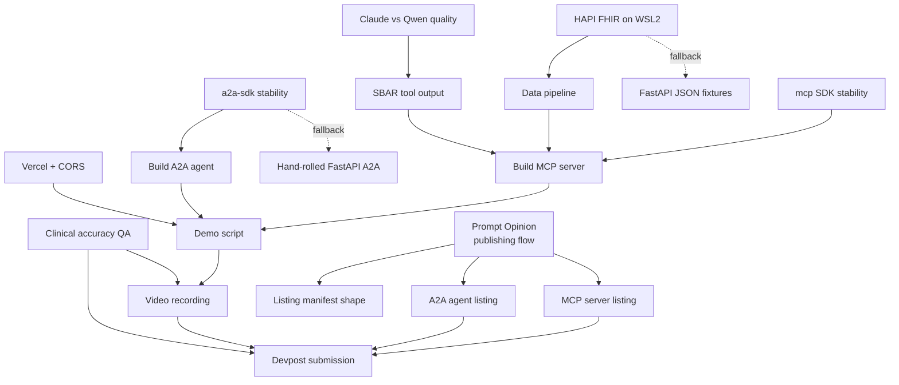

# Vigil — Risk Register

Owner of this document: Tech Lead. Last reviewed: 2026-04-15. Deadline: 2026-05-11.

This register tracks risks for the Vigil hackathon submission (MCP server + A2A agent + Next.js frontend + HAPI FHIR Docker + synthetic data, published to the Prompt Opinion Marketplace).

---

## 1. Risk Table

| ID | Risk | Category | P (1-5) | I (1-5) | Score | Mitigation | Owner | Trigger indicator | Contingency |
|----|------|----------|---------|---------|-------|------------|-------|-------------------|-------------|
| R01 | ~~Prompt Opinion publishing flow is undocumented~~ **DOWNGRADED 2026-04-22.** Darena Health's official "Getting Started" video documents the Marketplace Studio publishing walkthrough end-to-end. Residual risk is execution only: deploy + run the 5-min publish step. | Platform | ~~4~~ **1** | 5 | ~~20~~ **5** | Deploy to Render (configs ready in `deploy/render/`). Follow `docs/PO_PUBLISHING_RESEARCH.md` § "Confirmed Publishing Flow". Allow 30 min total. | Integration Lead | 48h before deadline with no successful listing. | Publish as GitHub repo + standalone Devpost video. Note "pending marketplace approval" in submission. |
| R02 | HAPI FHIR Docker image fails to boot on user's WSL2 (port binding, volume mounts, or JVM OOM). | Technical | 3 | 4 | 12 | Spin up `hapiproject/hapi:latest` on day 1. Pin known-good tag. Use bind mount under `/mnt/wsl` not `/mnt/d` for perf. Allocate >=4GB in `.wslconfig`. | Backend Eng | Container exits non-zero or `/fhir/metadata` 500s twice. | Fall back to in-memory JSON fixtures served by FastAPI, same FHIR R4 shape. |
| R03 | SBAR prose quality on Ollama Qwen 7B is visibly worse than Claude; judges see "AI slop". | Technical | 4 | 4 | 16 | Dev on Qwen for speed, but gate video/demo on Claude Sonnet. Golden-prompt test harness compares outputs nightly. | AI Eng | Side-by-side eval shows >=2 clinical omissions in Qwen output. | Switch dev to Claude Haiku (affordable). Budget $20 API credits as insurance. |
| R04 | Runtime error mid-take during 3-minute video, forcing painful re-record. | Ops | 4 | 4 | 16 | Pre-flight script: warm DB, warm LLM, clear caches, fix seed. Run demo 5x clean before recording. Record in 3 segments, not one. | Producer | Any non-zero exit or visible stack trace during rehearsal. | Record in segments, cut together. Keep a B-roll backup take. |
| R05 | Clinical judges (Mathur, Mandel) spot wrong vital values, wrong LOINC codes, or impossible lab panels. | Clinical | 3 | 5 | 15 | LOINC/SNOMED codes referenced against HL7 terminology server. Vitals ranges from NEWS2 spec. Peer review by anyone with clinical background. | Clinical Reviewer | Internal QA flags any value outside physiologic range. | Hot-fix synthetic dataset. Re-run pipeline before final video. |
| R06 | `a2a-sdk` has breaking changes mid-build or missing features we need. | Technical | 3 | 4 | 12 | Pin exact version in `pyproject.toml`. Read `po-adk-python` source (uses Google ADK + A2A, differs slightly). Keep abstraction layer thin. | Backend Eng | `pip install` pulls a version with different signature, or tests break on bump. | Implement A2A protocol by hand in ~50 lines of FastAPI following `po-adk-python` as reference. |
| R07 | Vercel frontend cannot reach local backend during demo recording (CORS, tunneling, cold starts). | Technical | 4 | 3 | 12 | Use `ngrok` or `cloudflared` tunnel for backend. Configure CORS allowlist with Vercel preview + prod URLs. Warm endpoints pre-take. | Frontend Eng | Browser devtools shows CORS error or 504 during rehearsal. | Record frontend against `localhost` backend, not deployed Vercel. Publish deployed version after. |
| R08 | Scope creep: team adds features (auth, multi-tenant, etc.) that are not in the 4-tool spec. | Ops | 4 | 3 | 12 | Freeze scope at end of week 1. Any new feature requires Tech Lead sign-off. Backlog has "post-hackathon" bucket. | Tech Lead | PR touches files outside agreed module boundaries. | Revert PR. Move idea to post-hackathon backlog. |
| R09 | Parallel agent/teammate coordination failures: duplicated work, conflicting contracts. | Ops | 3 | 3 | 9 | Daily 15-min sync. Shared interface doc (`ARCHITECTURE.md`) is the source of truth. Contracts frozen end of week 1. | Tech Lead | Two PRs touch same interface file with incompatible changes. | Tech Lead arbitrates, one person rewrites. |
| R10 | Synthetic FHIR data is not clinically plausible (wrong temporal order, impossible med combos). | Clinical | 3 | 4 | 12 | Base every patient scenario on a published case study. Validate with FHIR validator + custom rules. | Data Eng | Validator flags any resource, or rules engine flags an impossibility. | Regenerate offending patient from template. Keep fixtures small enough to hand-audit. |
| R11 | MCP/A2A protocol mismatches: Prompt Opinion runtime expects shape we are not producing. | Platform | 3 | 5 | 15 | Smoke-test against PO runtime as soon as we have an account. Follow MCP spec verbatim. Use official `mcp` SDK types, not dicts. | Backend Eng | PO runtime rejects registration or tool call. | Open Discord issue. Adjust. Worst case, ship via raw MCP (not PO marketplace). |
| R12 | Missed Discord/Devpost announcement about rule change, judging criteria, or deadline shift. | Ops | 2 | 4 | 8 | One teammate subscribes to all channels. Daily scrape of announcements channel. Pin important messages. | Producer | A rule change discovered after the fact. | Emergency team call. Re-plan within 2h. |
| R13 | Long agent sessions run out of context / token budget mid-task, corrupting partial work. | Technical | 3 | 3 | 9 | Checkpoint frequently (git commit). Keep agent scopes narrow. Persist plans to `docs/*.md`. | Tech Lead | Agent returns truncated output or references missing context. | Restart with narrower scope. Human takes over if blocking. |
| R14 | Merge conflicts between parallel teammates cause lost work. | Technical | 3 | 3 | 9 | Module-per-person file ownership. Rebase daily, not at end. Small PRs. | Tech Lead | Conflict in > 3 files on a single merge. | Pair-program the merge. Use `git mergetool`. |
| R15 | Pre-submission checklist missed items (private repo, broken demo URL, no captions). | Ops | 3 | 5 | 15 | The checklist in section 4 is run T-24h and T-2h. Two people sign off, not one. | Producer | Any checklist item not green at T-2h. | Fix immediately. Delay submission up to T-1h if needed. |
| R16 | Vercel free tier serverless cold starts or 10s function timeout kills the demo. | Technical | 2 | 3 | 6 | Keep frontend fully static (SSG). Backend is separate service, not Vercel function. Warm with cron ping. | Frontend Eng | Cold start > 3s during rehearsal. | Use Vercel Pro trial or host frontend on Netlify. |
| R17 | Legal: synthetic data accidentally contains real PHI (e.g., reused from a dataset). | Legal | 1 | 5 | 5 | Generate all data programmatically from seed. No external datasets. Grep for real names/SSNs. | Data Eng | Any suspiciously realistic record. | Regenerate dataset from scratch. Audit git history with `bfg` if needed. |
| R18 | Devpost submission itself fails (team list wrong, wrong category, upload size). | Ops | 2 | 5 | 10 | Create Devpost draft by end of week 1. Upload placeholder video early. Verify team members accept invite. | Producer | Devpost preview shows missing team or missing field. | Fix within platform. Email Devpost support as fallback. |

---

## 2. Top 5 Risks (Ranked)

| Rank | ID | Score | Risk | Owner | Daily status check-in plan |
|------|-----|-------|------|-------|---------------------------|
| 1 | R01 | 20 | Prompt Opinion publishing undocumented | Tech Lead | Every 09:00 standup: "PO listing status = not started / account / dry-run / live". Blocker escalated at T-7d if not at dry-run. |
| 2 | R03 | 16 | LLM quality gap Qwen vs Claude | AI Eng | Nightly golden-prompt eval; diff posted to team channel. Switch to Claude if 2 consecutive nights flag omissions. |
| 3 | R04 | 16 | Runtime error during video recording | Producer | T-3d: daily full demo dry-run. Report errors in standup. T-1d: three clean runs required before record. |
| 4 | R05 | 15 | Clinical inaccuracies spotted by judges | Clinical Reviewer | Every 09:00: "data QA = X patients reviewed / Y total". Must hit 100% by T-5d. |
| 5 | R11 | 15 | MCP/A2A protocol mismatch with PO runtime | Backend Eng | Couples with R01: every PO listing dry-run also exercises tool calls. Report in standup. |

R15 (pre-submission checklist) ties R05/R11 at 15 but is deferred to its own section 4 since it is procedural, not an unknown.

---

## 3. Kill Switches

Pre-committed pivots. These are NOT "maybe" — if the trigger fires, we execute without debate.

- **KS-1 — Prompt Opinion publishing blocked at T-48h.**
  Pivot: submit as GitHub repo + standalone video on Devpost. Add "Marketplace listing pending" note in Devpost description with link to draft listing.

- **KS-2 — HAPI FHIR fails to boot reliably on WSL2 after 1 full day of debugging.**
  Pivot: replace HAPI with FastAPI serving in-memory JSON fixtures that match FHIR R4 shape. Document the swap in `ARCHITECTURE.md` as a known limitation.

- **KS-3 — Qwen 7B SBAR output judged unacceptable in two consecutive nightly evals.**
  Pivot: switch all dev and demo runs to Claude Haiku. Allocate $20 API budget. Remove Ollama path from README critical path.

- **KS-4 — `a2a-sdk` breaking change or missing feature blocks A2A agent for > 4 hours.**
  Pivot: implement A2A protocol by hand in FastAPI (~50 LOC), using `github.com/prompt-opinion/po-adk-python` as reference for message envelope shape.

- **KS-5 — Clinical QA finds systematic errors in synthetic data at T-5d.**
  Pivot: cut scope to a single hand-curated patient scenario rather than a cohort. One correct story beats five wrong ones.

- **KS-6 — Video re-record needed at T-12h and no team member available.**
  Pivot: ship the last clean rehearsal take. Perfect is the enemy of submitted.

---

## 4. Pre-Submission Checklist (run T-24h and T-2h)

Two people sign off. No exceptions.

1. [ ] Video runtime < 3:00 (verified on stopwatch, not trust).
2. [ ] Video has captions (SRT uploaded or burned-in).
3. [ ] All 5 judge hooks (Mathur, Mandel, Hickey, Proctor, Zheng) verified present in demo or README.
4. [ ] GitHub repo is public (not private, not internal).
5. [ ] GitHub repo has topics set: `mcp`, `a2a`, `healthcare`, `fhir`, `hackathon`.
6. [ ] README complete: what / why / stack / run instructions / judge hook section.
7. [ ] Demo URL (Vercel) still live — click it from a fresh browser.
8. [ ] Prompt Opinion MCP listing live (or KS-1 executed and noted).
9. [ ] Prompt Opinion A2A agent listing live (or KS-1 executed and noted).
10. [ ] Devpost team list correct; every member has accepted the invite.
11. [ ] Devpost category correct (Option B).
12. [ ] `LICENSE` file present in repo root (MIT or Apache-2.0).
13. [ ] No PHI anywhere: `git grep -iE '(ssn|mrn-[0-9])'` returns clean.
14. [ ] `.env` / secrets not committed: `git ls-files | grep -i env` clean.
15. [ ] `docker-compose up` works from a fresh clone on a second machine.
16. [ ] `pytest` (or equivalent) green on main.
17. [ ] All 4 MCP tools callable via `mcp` SDK smoke test.
18. [ ] A2A agent responds to sample envelope.
19. [ ] Synthetic data FHIR-validator clean.
20. [ ] Submission description on Devpost mentions HAPI FHIR, MCP, A2A, and links repo + video + demo + PO listings.

---

## 5. Dependency Graph of External Unknowns

Which unknowns block which build tasks. Resolve top-of-graph unknowns first.

Reading order for the Tech Lead:
1. Resolve **PO** (R01) first — it gates two listings and we know nothing about it.
2. In parallel, resolve **WSL2 / HAPI** (R02) — if it fails we execute KS-2 and move on.
3. Resolve **a2a-sdk** (R06) — if it blocks, execute KS-4.
4. Resolve **LLM quality** (R03) — settle on Claude Sonnet for video by T-7d.
5. Everything downstream (demo, video, submission) can only stabilize once 1-4 are settled.

---

End of document.
