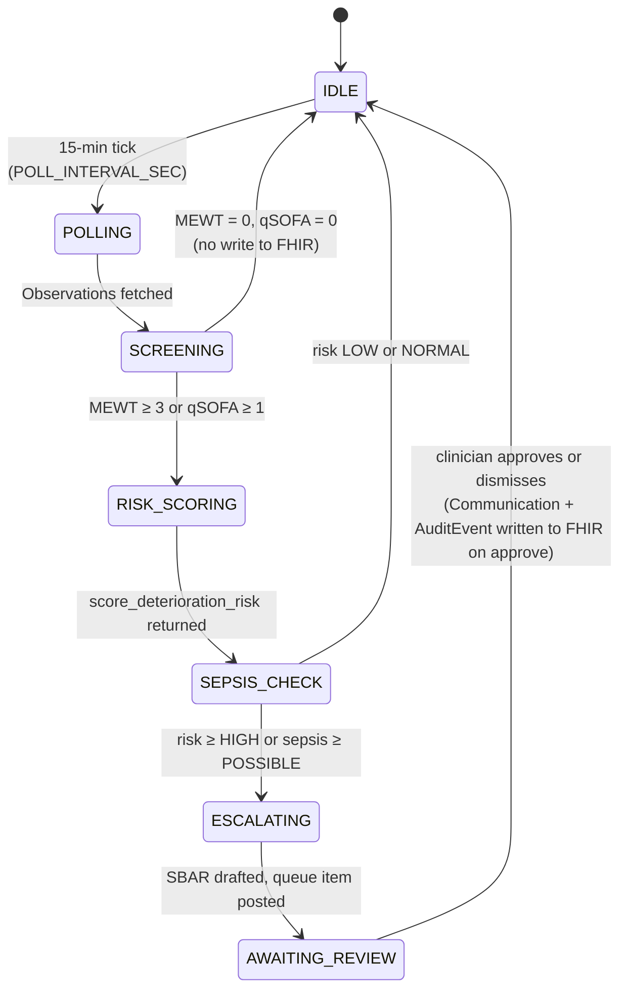
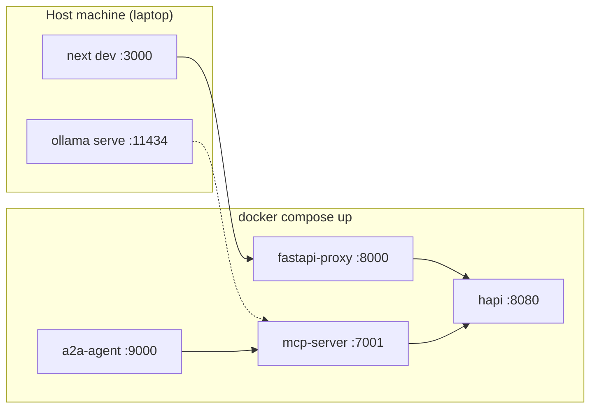

# Vigil — Architecture Diagram

> Source-of-truth visual for README, Prompt Opinion submission page, and the 2:40 "Architecture splash" beat.
> Render with any Mermaid-compatible viewer (GitHub, mermaid.live, Obsidian, VS Code extension).

---

## System Architecture

```mermaid
flowchart TB
    %% ── Styling ────────────────────────────────────────────────────────
    classDef platform   fill:#e8e8e8,stroke:#888,color:#222,font-weight:bold
    classDef frontend   fill:#dbeafe,stroke:#3b82f6,color:#1e3a8a
    classDef backend    fill:#fef3c7,stroke:#d97706,color:#78350f
    classDef fhir       fill:#d1fae5,stroke:#059669,color:#065f46
    classDef llm        fill:#ede9fe,stroke:#7c3aed,color:#3b0764
    classDef clinician  fill:#fce7f3,stroke:#db2777,color:#831843

    %% ── External Platform ──────────────────────────────────────────────
    subgraph PO["☁  Prompt Opinion Platform  (external, hosted)"]
        direction LR
        POR["A2A Runtime + MCP Router"]
        SHARP["SHARP Header Injector<br/><code>x-fhir-server-url</code><br/><code>x-fhir-access-token</code><br/><code>x-patient-id</code>"]
        POR --- SHARP
    end
    class PO platform

    %% ── Clinician ──────────────────────────────────────────────────────
    Clin(["👩‍⚕️  Clinician"])
    class Clin clinician

    %% ── Frontend Plane (Vercel) ────────────────────────────────────────
    subgraph Vercel["🔺  Vercel  —  Next.js 15 Dashboard"]
        direction TB
        V1["/ — Patient List<br/>(10 patients, risk-sorted)"]
        V2["/patients/[id] — Detail<br/>(Recharts vitals trend)"]
        V3["/patients/[id]/alerts/[alertId]<br/>(SBAR · Approve button)"]
        V4["/marketplace<br/>(MCP + A2A tiles)"]
    end
    class Vercel frontend

    %% ── Vigil Backend (Docker Compose) ────────────────────────────────
    subgraph Docker["🐳  Docker Compose  —  Vigil Backend"]
        direction TB

        subgraph FastAPI["FastAPI Proxy  :8000"]
            FA_R["GET /api/patients/*<br/>(read-through to HAPI)"]
            FA_W["POST /api/…/approve<br/>⚡ ONLY FHIR write entry point"]
        end

        subgraph MCP["MCP Server  :7001  (FastMCP / stdio+HTTP)"]
            T1["screen_vital_thresholds<br/>MEWT + qSOFA  (deterministic)"]
            T2["score_deterioration_risk<br/>6-hour trend  (LLM-assisted)"]
            T3["flag_sepsis_onset<br/>CDC SRS criteria  (deterministic)"]
            T4["generate_escalation_note<br/>SBAR JSON  (LLM, strict schema)"]
        end

        subgraph A2A["A2A Agent  :9000  (a2a-sdk)"]
            SM["State Machine<br/>IDLE → POLLING → SCREENING<br/>→ RISK_SCORING → SEPSIS_CHECK<br/>→ ESCALATING → AWAITING_REVIEW"]
            RQ["Review Queue<br/>(SQLite / in-memory)"]
            SM --> RQ
        end

        subgraph HAPI["HAPI FHIR R4  :8080  (hapiproject/hapi:v7.2.0)"]
            F1["Patient  ·  Observation  ·  Encounter"]
            F2["Condition  ·  Communication  ·  AuditEvent"]
        end
    end
    class FastAPI backend
    class MCP backend
    class A2A backend
    class HAPI fhir

    %% ── LLM Providers ──────────────────────────────────────────────────
    subgraph LLM["LLM Providers  (swappable via LLM_PROVIDER env)"]
        direction LR
        OLL["🦙 Ollama<br/>local dev"]
        GRQ["⚡ Groq<br/>fast fallback"]
        CLD["🔮 Claude Sonnet 4.5<br/>demo recording"]
        STB["🧪 Stub<br/>unit tests"]
    end
    class LLM llm

    %% ── Synthetic Data ─────────────────────────────────────────────────
    SD[/"📄 Synthetic FHIR Bundles<br/>PT-001 stable · PT-007 HIGH<br/>PT-009 sepsis · PT-010 hemorrhage"/]

    %% ── Edges ──────────────────────────────────────────────────────────
    Clin -->|browser| Vercel
    Vercel -->|"REST reads<br/>:8000/api/*"| FA_R
    Vercel -->|"POST approve<br/>:8000/api/…/approve"| FA_W
    FA_R -->|"FHIR R4 GET"| HAPI
    FA_W -->|"POST Communication<br/>+ AuditEvent"| HAPI

    POR -->|"A2A JSON-RPC"| A2A
    POR -->|"MCP JSON-RPC<br/>+ SHARP headers"| MCP

    SM -->|"MCP tool calls<br/>(4 tools)"| MCP
    SM -->|"FHIR GET polls"| HAPI
    MCP -->|"FHIR R4 REST<br/>(reads via SHARP context)"| HAPI

    T2 & T4 -.->|"LLMProvider protocol"| LLM

    SD -.->|"seed_patients.sh"| HAPI

    Clin -.->|"reviews + approves<br/>via Prompt Opinion UI"| POR
```



---

## SHARP Header Flow Detail

```mermaid
sequenceDiagram
    participant PO as Prompt Opinion<br/>Platform
    participant MCP as MCP Server<br/>:7001
    participant FHIR as HAPI FHIR<br/>:8080

    PO->>MCP: POST /mcp/call screen_vital_thresholds<br/>Headers:<br/>  x-fhir-server-url: http://hapi:8080/fhir<br/>  x-fhir-access-token: &lt;session-token&gt;<br/>  x-patient-id: PT-007
    Note over MCP: FhirContext.from_headers()<br/>builds scoped client
    MCP->>FHIR: GET /fhir/Observation<br/>?patient=PT-007&_sort=-date&_count=10<br/>Authorization: Bearer &lt;session-token&gt;
    FHIR-->>MCP: Bundle (10 Observations)
    MCP->>MCP: MEWT=5, qSOFA=1 → TRIGGERED
    MCP-->>PO: {status: "TRIGGERED", mewt: 5, qsofa: 1, note: "…"}
```

---

## State Machine Detail



---

## Deployment Topology



---

*Sources: `docs/ARCHITECTURE.md`, `docs/FRONTEND_SPEC.md`*
*Last updated: 2026-04-19*
